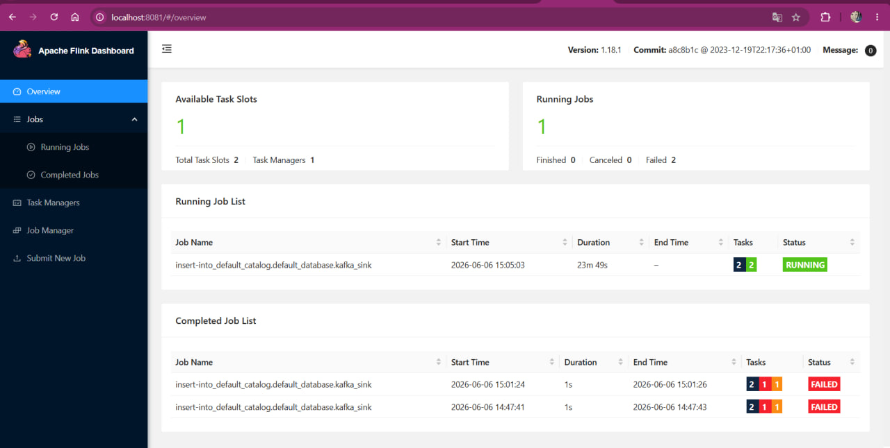

## Проект по БИГДАТА HSE

```markdown
# Flink IoT Analytics Platform

Реализация конвейера потоковой обработки данных (Stream Processing) с датчиков IoT в реальном времени на базе **Apache Flink** и **Apache Kafka**. Проект разработан в рамках учебного курса по Big Data в НИУ ВШЭ.

## 🛠 Стек технологий
* **Java 11** (сборка через Maven)
* **Apache Flink 1.18.1** (DataStream API)
* **Apache Kafka** (в качестве источника данных / Source)
* **Docker & Docker Compose** (для локального развертывания кластера)

---

## 📊 Структура данных (IoTEvent)
Система принимает из Kafka события в формате JSON со следующей структурой:
```json
{
  "id": 1,
  "event_time": "2026-06-06 15:05:01",
  "temperature": 24.5,
  "humidity": 42.1
}

```

> **Важно:** Поле `event_time` обрабатывается на стороне Flink как строка (`String`) с последующим кастомным парсингом в Event Time для корректной генерации вотермарок (Watermarks). Это позволяет избежать конфликтов со встроенными затенёнными (shaded) зависимостями Jackson во Flink.

---

## 🚀 Инструкция по сборке и запуску

Все команды выполняются из корневой директории проекта `flink-iot-analytics`.

### 1. Сборка проекта (Uber-JAR)

Для компиляции кода и сборки "толстого" jar-ника со всеми необходимыми коннекторами (Kafka, JDBC/Postgres) выполните:

```bash
mvn clean package

```

После успешной сборки в папке `target/` появится файл `flink-iot-analytics-1.0-SNAPSHOT.jar`.

### 2. Деплой на Flink JobManager

Скопируйте собранный jar-файл внутрь работающего Docker-контейнера Flink:

```bash
docker cp target/flink-iot-analytics-1.0-SNAPSHOT.jar flink-jobmanager:/tmp/job.jar

```

### 3. Запуск Flink-джобы

Запустите потоковую задачу в кластере, указав главный класс приложения:

```bash
docker exec -it flink-jobmanager flink run -c ru.hse.bigdata.DataStreamJob /tmp/job.jar

```

---

## 🖥 Мониторинг и управление

После запуска вы можете отслеживать состояние конвейера, метрики, количество обработанных записей и граф выполнения через веб-интерфейс Flink:

🔗 **Flink Web UI:** [http://localhost:8081](https://www.google.com/search?q=http://localhost:8081)

* При успешном запуске задача перейдет в статус **RUNNING** и займет доступный Task Slot.
* Логи контейнера для отладки можно посмотреть командой: `docker logs flink-jobmanager --tail 100`

---
## Пример работы


```

```
